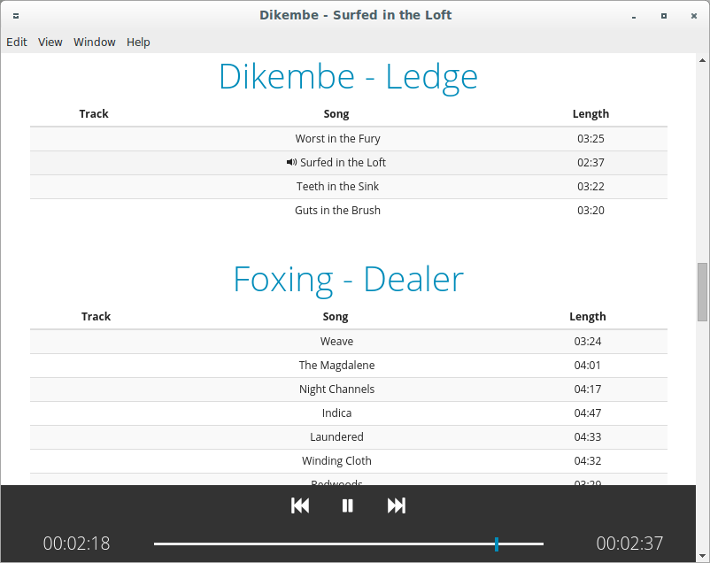

# Electron Music Player

This is a prototype for a music player written in Electron with Angular.js. It's missing a lot of features because they take a lot of time to implement, but to core functionality works.

To use, go to `/app/scripts/services/discography.js` and set the `librarypath` variable to the path to your music library.

Example screenshot:

